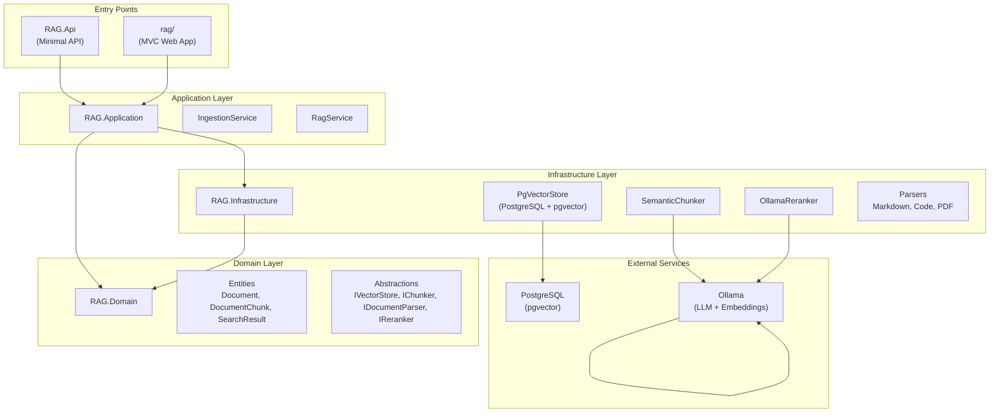
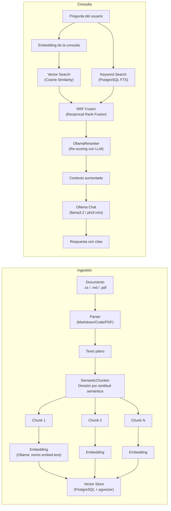

# RAG — Retrieval-Augmented Generation con .NET 10, Ollama y PostgreSQL

Sistema RAG (Retrieval-Augmented Generation) que permite cargar documentos, indexarlos semánticamente y hacer preguntas en lenguaje natural sobre su contenido. Construido con **.NET 10**, **Arquitectura Limpia**, **Ollama** para generación y embeddings, y **PostgreSQL + pgvector** para búsqueda híbrida vectorial + textual.

---

## Tabla de Contenidos

- [Arquitectura](#arquitectura)
- [Pipeline RAG](#pipeline-rag)
- [Estructura del Proyecto](#estructura-del-proyecto)
- [Stack Tecnológico](#stack-tecnológico)
- [Requisitos Previos](#requisitos-previos)
- [Configuración Inicial](#configuración-inicial)
- [Ejecución](#ejecución)
- [Uso](#uso)
- [API REST](#api-rest)
- [Pruebas](#pruebas)
- [Despliegue](#despliegue)
- [Desarrollo](#desarrollo)
- [Decisiones Técnicas](#decisiones-técnicas)

---

## Arquitectura

El proyecto sigue **Arquitectura Limpia** (Clean Architecture) con separación estricta en capas. Las dependencias apuntan hacia adentro: Domain no conoce nada, Application conoce Domain, Infrastructure conoce Application, y los entry points (API + MVC) conocen Infrastructure.



### Flujo de dependencias

- **RAG.Domain**: Entidades (`Document`, `DocumentChunk`, `SearchResult`) y abstracciones (`IVectorStore`, `IChunker`, `IDocumentParser`, `IReranker`). Sin dependencias externas.
- **RAG.Application**: Servicios de orquestación (`IngestionService`, `RagService`). Depende solo de Domain.
- **RAG.Infrastructure**: Implementaciones concretas de las abstracciones. Depende de Application.
- **RAG.Api** / **rag**: Entry points HTTP. Dependen de Infrastructure.

---

## Pipeline RAG



### Etapas detalladas

#### 1. Ingestión de documentos

| Paso | Descripción |
|------|-------------|
| **Parser** | Detecta el tipo de archivo (.cs, .md, .pdf) y extrae texto plano. Cada parser implementa `IDocumentParser`. |
| **Semantic Chunker** | Divide el texto en fragmentos semánticos usando similitud coseno entre embeddings de grupos de oraciones. Donde la similitud cae por debajo de 0.65, detecta un cambio de tema y crea un nuevo chunk. |
| **Embedding** | Genera un vector de 768 dimensiones por chunk usando `nomic-embed-text` vía Ollama. |
| **Almacenamiento** | Guarda chunk + embedding en PostgreSQL con pgvector, usando `COPY` binario para batches grandes. |

#### 2. Consulta (Ask)

| Paso | Descripción |
|------|-------------|
| **Embedding de consulta** | Genera el vector semántico de la pregunta del usuario. |
| **Vector Search** | Busca los chunks más similares por distancia coseno (`<=>`). |
| **Keyword Search** | Busca por coincidencia textual usando `websearch_to_tsquery` de PostgreSQL. |
| **RRF Fusion** | Combina ambos rankings con Reciprocal Rank Fusion (RRF, k=60) para resultados híbridos. |
| **Reranking** | Re-ordena los top 20 resultados usando el LLM de Ollama como juez de relevancia. |
| **Generación** | Construye un prompt con el contexto aumentado y pregunta al LLM, exigiéndole que responda solo con la información disponible. |

---

## Estructura del Proyecto

```
RAG.slnx                          # Solution file (SLNX — .NET 10)
├── src/
│   ├── RAG.Domain/               # Capa de dominio — entidades y contratos
│   │   ├── Entities/              Document.cs, DocumentChunk.cs, SearchResult.cs
│   │   └── Abstractions/          IVectorStore, IChunker, IDocumentParser, IReranker
│   │
│   ├── RAG.Application/          # Capa de aplicación — casos de uso
│   │   └── Services/              IngestionService.cs, RagService.cs
│   │
│   ├── RAG.Infrastructure/       # Implementaciones concretas
│   │   ├── VectorStore/           PgVectorStore.cs (PostgreSQL + pgvector)
│   │   ├── Chunking/              SemanticChunker.cs
│   │   ├── Parsing/               MarkdownParser.cs, CodeParser.cs, PdfParser.cs
│   │   └── Reranking/             OllamaReranker.cs
│   │
│   └── RAG.Api/                  # Entry point: Minimal API
│       ├── Endpoints/             RagEndpoints.cs
│       └── Program.cs
│
├── rag/                          # Entry point: MVC Web App (ASP.NET Core)
│   ├── Controllers/               HomeController, DocumentsController, AskController
│   ├── Models/                    AskViewModel, UploadViewModel, ErrorViewModel
│   ├── Views/                     Ask/, Documents/, Home/, Shared/
│   └── wwwroot/                   CSS, JS, lib (Bootstrap, jQuery)
│
├── tests/
│   └── RAG.Mvc.Tests/            # Tests xUnit + Moq + WebApplicationFactory
│       └── Controllers/           AskControllerTests, DocumentsControllerTests
│
├── scripts/
│   └── init-db.sql               # Inicialización de PostgreSQL + pgvector
│
└── openspec/                     # Artefactos de especificación (OpenSpec)
    ├── config.yaml
    ├── specs/                     mvc-document-upload/spec.md, mvc-rag-ask/spec.md
    └── changes/archive/           Historial de cambios completados
```

---

## Stack Tecnológico

| Componente | Tecnología | Versión |
|---|---|---|
| **Runtime** | .NET | 10.0 |
| **Web (Entry 1)** | ASP.NET Core MVC | 10.0 |
| **Web (Entry 2)** | ASP.NET Core Minimal API | 10.0 |
| **Base de datos** | PostgreSQL + pgvector | — |
| **ORM / DDBB** | Dapper + Npgsql | 2.1.79 / 10.0.3 |
| **LLM** | Ollama (llama3.2 / phi3:mini) | — |
| **Embeddings** | Ollama (nomic-embed-text, 768d) | — |
| **AI Abstractions** | Microsoft.Extensions.AI | 9.7.0 |
| **Tests** | xUnit + Moq + WebApplicationFactory | 17.13.0 / 4.20.72 / 10.0.10 |

---

## Requisitos Previos

| Herramienta | Versión | Instalación |
|---|---|---|
| [.NET SDK](https://dotnet.microsoft.com/download) | 10.0+ | `winget install Microsoft.DotNet.SDK.10` |
| [PostgreSQL](https://www.postgresql.org/download/) | 16+ | `winget install PostgreSQL.PostgreSQL` |
| [pgvector](https://github.com/pgvector/pgvector) | 0.8+ | `CREATE EXTENSION vector;` |
| [Ollama](https://ollama.com/) | 0.5+ | `winget install Ollama.Ollama` |
| Modelos Ollama | | `ollama pull llama3.2 && ollama pull nomic-embed-text` |

---

## Configuración Inicial

### 1. Base de datos

```bash
# Crear la base de datos
psql -U postgres -c "CREATE DATABASE rag;"

# Ejecutar el script de inicialización
psql -U postgres -d rag -f scripts/init-db.sql
```

El script crea:
- Extensión `vector` para pgvector
- Tabla `documents` con metadata del documento
- Tabla `chunks` con contenido, embedding vectorial (768d) y metadata JSONB
- Índice IVFFlat para búsqueda por similitud coseno
- Índice GIN para full-text search

### 2. Descargar modelos Ollama

```bash
ollama pull llama3.2       # Modelo de chat (~2 GB)
ollama pull phi3:mini       # Alternativa más ligera (~2.2 GB)
ollama pull nomic-embed-text  # Modelo de embeddings (~274 MB)
```

### 3. Configurar User Secrets (entorno local)

```bash
cd rag/
dotnet user-secrets set "ConnectionStrings:PostgreSQL" \
    "Host=localhost;Database=rag;Username=postgres;Password=tu_password"
```

Esto evita que credenciales queden en el repositorio. El `appsettings.json` contiene un placeholder seguro (`Password=__SECRET__`).

### 4. Verificar configuración

Revisar `rag/appsettings.json`:

```json
{
  "AI": {
    "Provider": "Ollama",
    "Ollama": {
      "BaseUrl": "http://localhost:11434",
      "ChatModel": "phi3:mini",
      "EmbeddingModel": "nomic-embed-text"
    }
  },
  "ConnectionStrings": {
    "PostgreSQL": "Host=localhost;Database=rag;Username=postgres;Password=__SECRET__"
  },
  "DocumentUpload": {
    "MaxFileSize": 10485760
  }
}
```

Si usás un modelo distinto (ej: `llama3.2`), cambialo en `ChatModel`. Si Ollama corre en otro host/puerto, ajustá `BaseUrl`.

---

## Ejecución

### Opción 1: MVC Web App (recomendada)

```bash
dotnet run --project rag/
# Escucha en: http://localhost:5000
```

### Opción 2: Minimal API

```bash
dotnet run --project src/RAG.Api/
# Escucha en: http://localhost:5001
```

### Opción 3: Ambos entry points

```bash
# Terminal 1
dotnet run --project rag/

# Terminal 2
dotnet run --project src/RAG.Api/
```

---

## Uso

### Web UI (MVC — puerto 5000)

| Ruta | Descripción |
|---|---|
| `/` | Home |
| `/Documents` | Subir documentos (.cs, .md, .pdf) |
| `/Ask` | Hacer preguntas sobre los documentos indexados |

**Flujo típico:**

1. Navegá a **Upload** → seleccioná un archivo `.cs` o `.md` → submit
2. Navegá a **Ask** → escribí una pregunta en lenguaje natural → obtené la respuesta con contexto

### API REST (puerto 5001)

| Método | Ruta | Descripción |
|---|---|---|
| `POST` | `/api/rag/ingest` | Subir un documento para indexar |
| `POST` | `/api/rag/ask` | Hacer una pregunta |
| `GET` | `/api/rag/health` | Health check |

**Ejemplo con curl:**

```bash
# Subir documento
curl -X POST http://localhost:5001/api/rag/ingest \
  -F "file=@README.md"

# Preguntar
curl -X POST http://localhost:5001/api/rag/ask \
  -H "Content-Type: application/json" \
  -d '{"query": "¿De qué trata este proyecto?"}'

# Health check
curl http://localhost:5001/api/rag/health
```

---

## API REST

### `POST /api/rag/ingest`

Sube un documento y lo indexa en el vector store.

**Request:** `multipart/form-data`

| Campo | Tipo | Descripción |
|---|---|---|
| `file` | `IFormFile` | Archivo a procesar (.cs, .md, .pdf) |

**Response 200:**

```json
{
  "documentId": "guid",
  "fileName": "ejemplo.cs",
  "size": 1234,
  "createdAt": "2026-07-30T12:00:00Z"
}
```

**Errores:**
- `400` — archivo vacío o tipo no soportado
- `415` — content type no soportado
- `413` — archivo excede el tamaño máximo

### `POST /api/rag/ask`

Realiza una pregunta sobre los documentos indexados.

**Request:**

```json
{
  "query": "¿cómo se implementa el chunking?",
  "topKRetrieve": 20,
  "topKRank": 5
}
```

| Campo | Tipo | Default | Descripción |
|---|---|---|---|
| `query` | `string` | — | Pregunta en lenguaje natural |
| `topKRetrieve` | `int` | 20 | Cantidad de chunks a recuperar del hybrid search |
| `topKRank` | `int` | 5 | Cantidad de chunks a usar como contexto tras reranking |

**Response 200:**

```json
{
  "answer": "El chunking se implementa mediante SemanticChunker..."
}
```

---

## Pruebas

### Suite de tests

```bash
dotnet test tests/RAG.Mvc.Tests/
```

### Tests incluidos

| ID | Test | Tipo | Lo que prueba |
|---|---|---|---|
| 5.1 | `Ask_Post_EmptyQuery_ReturnsViewWithValidationError` | Unit | Query vacío → error de validación, sin llamada al pipeline |
| 5.2 | `Upload_Post_UnsupportedFileType_ReturnsViewWithValidationError` | Unit | .exe rechazado con mensaje listando tipos válidos |
| 5.3 | `Upload_Post_EmptyFile_ReturnsViewWithValidationError` | Unit | Archivo de 0 bytes → error de validación |
| 5.4 | `Ask_Post_ValidQuestion_ReturnsResultViewWithAnswer` | Integration | Pregunta válida → respuesta con "Paris" |
| 5.5 | `Upload_Post_ValidCsFile_ReturnsResultViewWithSuccess` | Integration | Archivo .cs válido → vista de éxito con nombre y tipo |

Los tests de integración usan `WebApplicationFactory` con servicios stub (Moq) para evitar dependencia de Ollama o PostgreSQL en tiempo de test.

### Verificación manual

Ver `tests/RAG.Mvc.Tests/ManualTests.md` para escenarios de prueba manual, incluyendo:
- Graceful error cuando Ollama no está disponible
- Verificación de que no se exponen stack traces al usuario

---

## Despliegue

### Producción

```bash
dotnet publish rag/ -c Release -o ./publish
```

La aplicación requiere:
- PostgreSQL con pgvector accesible desde el host de deploy
- Ollama corriendo (o un proveedor alternativo de `IChatClient`/`IEmbeddingGenerator`)

### Configuración por entorno

Usar variables de entorno o User Secrets para sobrescribir `appsettings.json`:

```bash
# Linux / macOS
export ConnectionStrings__PostgreSQL="Host=..."
export AI__Ollama__BaseUrl="http://ollama:11434"

# Windows (PowerShell)
$env:ConnectionStrings__PostgreSQL = "Host=..."
$env:AI__Ollama__BaseUrl = "http://ollama:11434"
```

---

## Desarrollo

### Convenciones

- **Arquitectura Limpia**: Las dependencias apuntan hacia Domain. Domain no conoce Infrastructure.
- **Tests primero** (aunque no esté en strict TDD mode): Los tests están especificados en los specs de OpenSpec.
- **Semantic Chunking**: División inteligente por tema, no por cantidad de tokens.
- **Búsqueda híbrida**: Vector + keyword con RRF fusion para mayor precisión.
- **User Secrets**: Nunca committear credenciales en `appsettings.json`.

### Extensiones planeadas

| Feature | Estado |
|---|---|
| Multi-tenancy con aislamiento por usuario | Especificado (SHOULD) |
| Escáner de directorio para ingesta automática | Especificado (SHOULD) |
| Parser PDF real (PdfPig / iText) | Pendiente de implementar |
| Citas con fragmentos exactos del documento fuente | Especificado (MUST) |
| Provider alternativo (OpenAI, Azure OpenAI) | Especificado (MUST) |

### Agregar un nuevo Parser

1. Implementá `IDocumentParser` en `RAG.Infrastructure/Parsing/`
2. Registralo en `DependencyInjection.cs` dentro del mismo archivo:

```csharp
services.AddSingleton<IDocumentParser, TuNuevoParser>();
```

El sistema usa inyección de dependencias con `IEnumerable<IDocumentParser>`, así que no requiere más cambios.

---

## Decisiones Técnicas

### ¿Por qué Arquitectura Limpia?

Separación de responsabilidades clásica:
- **Domain** define contratos (interfaces) y entidades sin dependencias externas
- **Application** orquesta flujos sin conocer implementation details
- **Infrastructure** implementa los contratos y lidia con la complejidad técnica
- **Entry points** son delgados y solo configuran DI

### ¿Por qué búsqueda híbrida (vector + keyword)?

La búsqueda semántica sola falla en términos exactos (nombres de métodos, siglas). La búsqueda textual sola no entiende sinónimos ni contexto. La combinación con RRF (Reciprocal Rank Fusion) da lo mejor de ambos mundos.

### ¿Por qué RRF y no promediar scores?

RRF no requiere normalizar scores entre dos sistemas de ranking distintos (distancia coseno vs. ts_rank). Es robusto, simple y funciona bien empíricamente.

### ¿Por qué SemanticChunker?

El chunking por cantidad fija de tokens (naive) corta oraciones y pierde contexto. El chunking semántico detecta cambios de tema usando similitud de embeddings entre grupos de oraciones, produciendo fragmentos coherentes.

### ¿Por qué reranking con el LLM?

El vector search puede traer falsos positivos semánticos. Un segundo pase con el LLM evaluando relevancia directamente mejora la precisión del contexto que se le pasa al generador.

---

## Esquema de Base de Datos

```sql
-- Extensión vectorial
CREATE EXTENSION IF NOT EXISTS vector;

-- Documentos
CREATE TABLE documents (
    id UUID PRIMARY KEY,
    file_name TEXT NOT NULL,
    content_type TEXT NOT NULL,
    size BIGINT NOT NULL,
    created_at TIMESTAMPTZ NOT NULL DEFAULT NOW()
);

-- Chunks con embeddings
CREATE TABLE chunks (
    id UUID PRIMARY KEY,
    document_id UUID NOT NULL REFERENCES documents(id) ON DELETE CASCADE,
    content TEXT NOT NULL,
    chunk_index INT NOT NULL,
    metadata JSONB DEFAULT '{}'::jsonb,
    embedding vector(768)         -- nomic-embed-text: 768 dimensiones
);

-- Índices
CREATE INDEX idx_chunks_document_id ON chunks(document_id);
CREATE INDEX idx_chunks_embedding
    ON chunks USING ivfflat (embedding vector_cosine_ops)
    WITH (lists = 100);
CREATE INDEX idx_chunks_content_fts
    ON chunks USING GIN (to_tsvector('english', content));
```

---

## Licencia

Este proyecto forma parte del curso **Inteligencia Artificial — EXIA**. Uso educativo.
